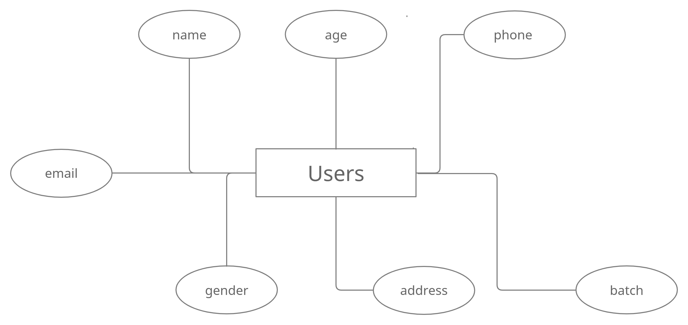
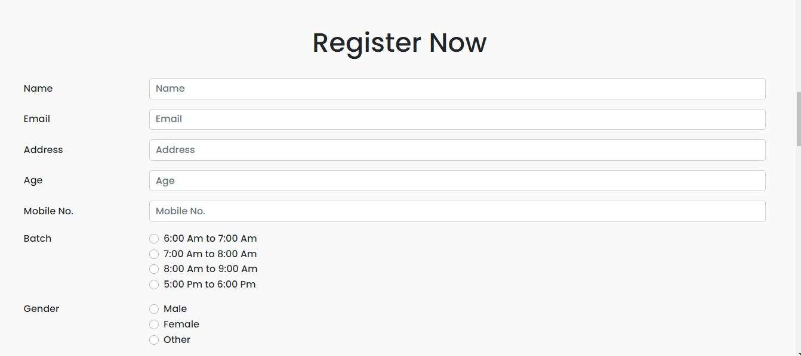
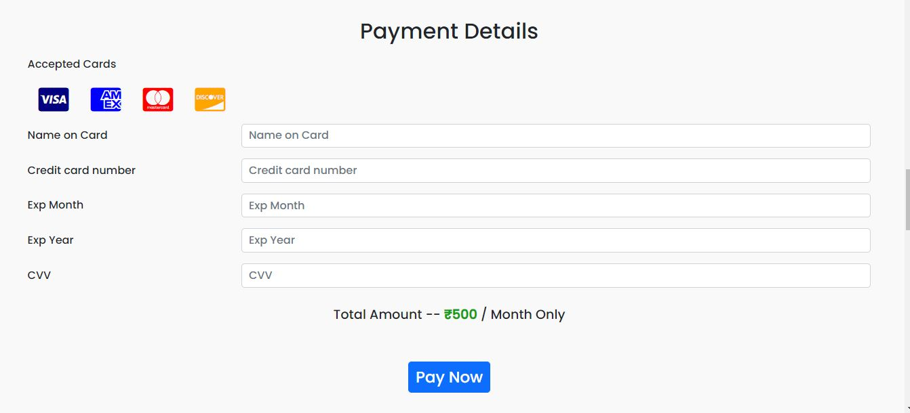

# Yoga - Classes

This Project is made in MERN Stack ( MongoDB , ExpressJS , ReactJS , NodeJS )

**Live Link** -- https://azure-marlin-coat.cyclic.app/

**See Some ScreenShots of Project At Last**

## Problem Statement

Assume that you are the CTO for the outsourcing firm which has been chosen to build an admission form for the Yoga Classes which happen every month.

Requirements for the admission form are:

- Only people within the age limit of 18-65 can enroll for the monthly classes and they will
  be paying the fees on a month on month basis. I.e. an individual will have to pay the fees
  every month and he can pay it any time of the month.
- They can enroll any day but they will have to pay for the entire month. The monthly fee is
  500/- Rs INR.
- There are a total of 4 batches a day namely 6-7AM, 7-8AM, 8-9AM and 5-6PM. The
  participants can choose any batch in a month and can move to any other batch next
  month. I.e. participants can shift from one batch to another in different months but in
  same month they need to be in same batch

## Solution

I have made an Yoga-Classes website. it is basically a Ragistration Website which help user to Register for their monthly yoga classes and it also help admin to manage their data.

In this project, we have made a frontend with help of React Js and for the backend, we have used Node js with Express Js framework and for storing data, we have used MongoDB as Database.

On the other hand, We have created Attrative And Responsive UI Design. and also Implemented Detailed Validation for User Inputs . We also take care of Invalid Routes.

that's all about my project Thank You

## Features

- Registration Section for Users
- Attrative And Responsive UI
- Detailed Validation for User Details
- User Data was Stored on MongoDB Atlas ( Cloud Storage for MongoDB )

## Future Improvement

- We can use the Luhn algorithm for validating credit card
- Introduce Login System for User which help them to track there progress
- We can Implement Payment Using Stripe ( Stripe is a suite of APIs powering online payment processing )
- Different plans for different Users
- Alert System for Rescheduling of Classes
- Detailed Page which give more info about Yoga Teachers which help for building trust between Client and User  

## ER Diagram of Database 



## Installation

Install my-project with npm

For Backend

```bash
  npm i
```

For Frontend

```bash
  cd frontend
  npm i
```

## Environment Variables

To run this project, you will need to add the following environment variables to your .env file

`DATABASE`

fill each filed with your info respectively

## Author


Hello Guys, my name is Ashutosh Adhao, i am currently in final year you can connect me by. . .

- [LinkedIn](https://www.linkedin.com/in/ashutoshadhao/)
- [Instagram](https://www.instagram.com/ashutoshadhao/)

## Screenshots







