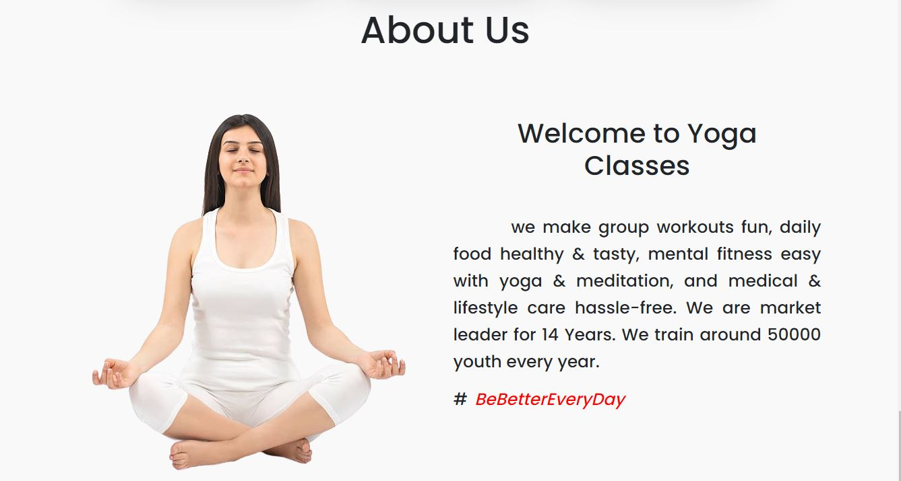
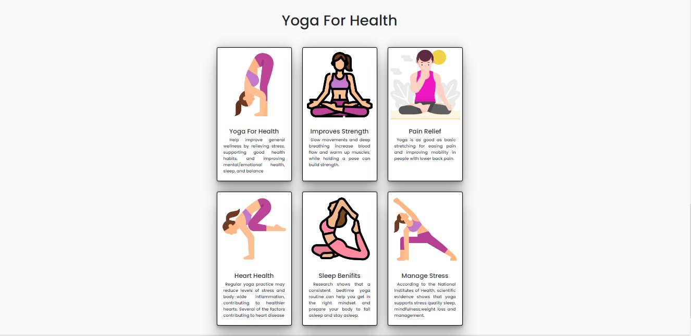

# Yoga - Classes

This Project is made in MERN Stack ( MongoDB , ExpressJS , ReactJS , NodeJS )

**Live Link** -- https://azure-marlin-coat.cyclic.app/

**See Some ScreenShots of Project At Last**

## Features

- Registration Section for Needed One
- Attrative And Responsive UI  
- Detailed Validation for User Details
- User Data was Stored on MongoDB Atlas ( Cloud Storage for MongoDB Atlas )

## Installation

Install my-project with npm

For Backend

```bash
  npm i
```

For Frontend 

```bash
  cd frontend
  npm i
```

## Environment Variables

To run this project, you will need to add the following environment variables to your .env file

`DATABASE`

fill each filed with your info respectively

## Author

Hello Guys, my name is Ashutosh Adhao, i am currently in final year you can connect me by. . .

- [LinkedIn](https://www.linkedin.com/in/ashutoshadhao/)
- [Instagram](https://www.instagram.com/ashutoshadhao/)

## Screenshots







<!-- 


 -->
